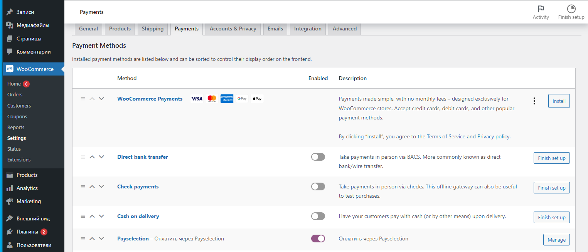
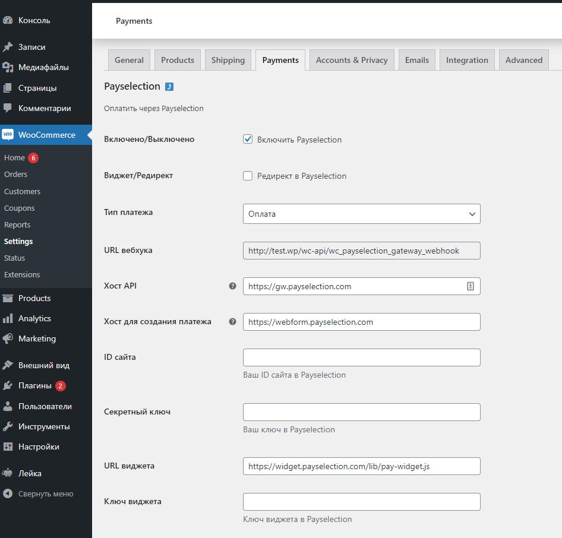
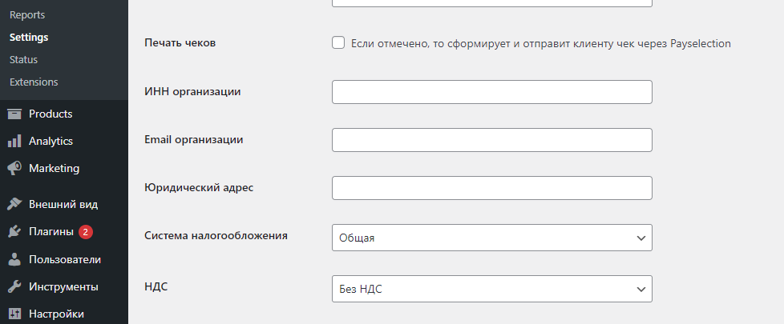

# WooCommerce Payselection gateway plugin

### Возможности

✔ Автоматическая установка флага «Оплачено» при прохождении оплаты.

✔ Передача информации для печати чеков (54-ФЗ):

* через Payselection;
* если необходимо использовать сторонний сервис, то в настройках уберите галочку «Печать чеков».

### Установка плагина

* Создайте резервную копию вашего сайта и базы данных
* Скачайте архив плагина [wordpress-woocommerce](https://github.com/Payselection/wordpress-woocommerce/archive/refs/heads/master.zip)
* Распакуйте архив и скопируйте папку `payselection-gateway` в папку `/wp-content/plugins/` вашего сайта
* Войдите в админку сайта и выберите пункт меню `Плагины -> Установленные`
* Активируйте плагин `Payselection Gateway for WooCommerce`. Будет добавлена платежная система Payselection к способам оплаты в WooCommerce.

### Настройки плагина

После установки и активации плагина, в способах оплат WooCommerce появится новая платежная система Payselection. Ее необходимо настроить.

* Зайти в административную часть сайта.
* Перейти на страницу WooCommerce → Настройки → Платежные системы.
* Найти платёжную систему "Payselection" и нажать кнопку _Manage_.

### Настройки платёжной системы Payselection

* Если вы хотите использовать редирект, поставьте галочку в опции _Редирект в Payselection_. По умолчанию будет использоваться виджет.
* Выберите _Тип платежа_: оплата (одностадийная операция оплаты – денежные средства списываются сразу после ее проведения) или блокировка (двухстадийная операция оплаты – денежные средства блокируются на карте и если не подтвердить транзакцию запросом на списание в течение 5 дней, снятие денежных средств будет автоматически отменено).
* Введите в полях  _Хост API_, _Хост для создания платежа_, _ID сайта_, _Секретный ключ_, _URL виджета_ и _Ключ виджета_ значения, полученные от Payselection.
* Нажать _Сохранить_.

### Настройка интеграции с онлайн-кассами

В настройках платежной системы:
* Включить опцию _Печать чеков_
* Выбрать систему налогообложения магазина в раскрывающемся меню _Система налогообложения_
* Выбрать необходимую ставку налога для доставки для передачи в чек в списке _НДС_.
* Заполнить _ИНН организации_
* Заполнить _Email организации_
* Заполнить _Юридический адрес_

### Данные тестовой карты:

* Номер карты __4111111111111111__
* Месяц: если <=6 то успешно, если >=7 то отказ
* Год: любой больше либо равно текущему
* CVC __123__